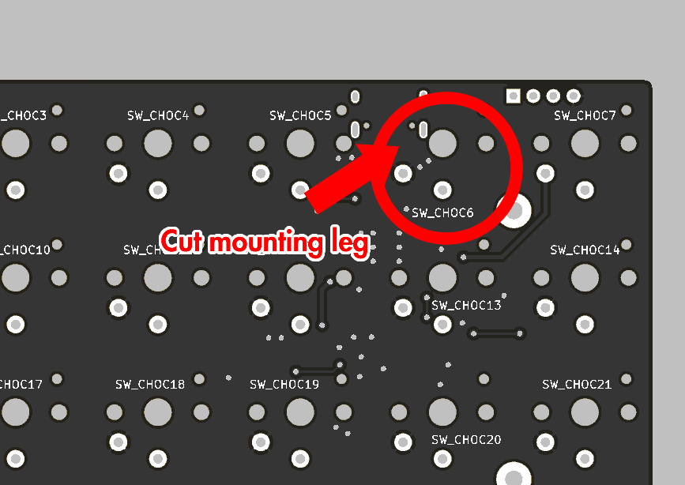

# CHOCO

7x4 ortholinear onehanded keyboard/macropad.   

- kailh choc switch (pg1350)
- USB type-c
- STM32F072C8T6
- QMK Firmware - https://github.com/hsgw/qmk_firmware/tree/choco

## BUILD
### Cut mounting leg (SW_CHOC6)

### How to enter bootloader
1. Push and hold reset switch
2. Push and hold boot switch (SW_CHOC7 / right upper corner switch)
3. Release reset switch
4. Release boot switch

### Firmware
QMK Firmware - https://github.com/hsgw/qmk_firmware/tree/choco

## License
MIT license   
(c)2019 Takuya Urakawa, Dm9Records